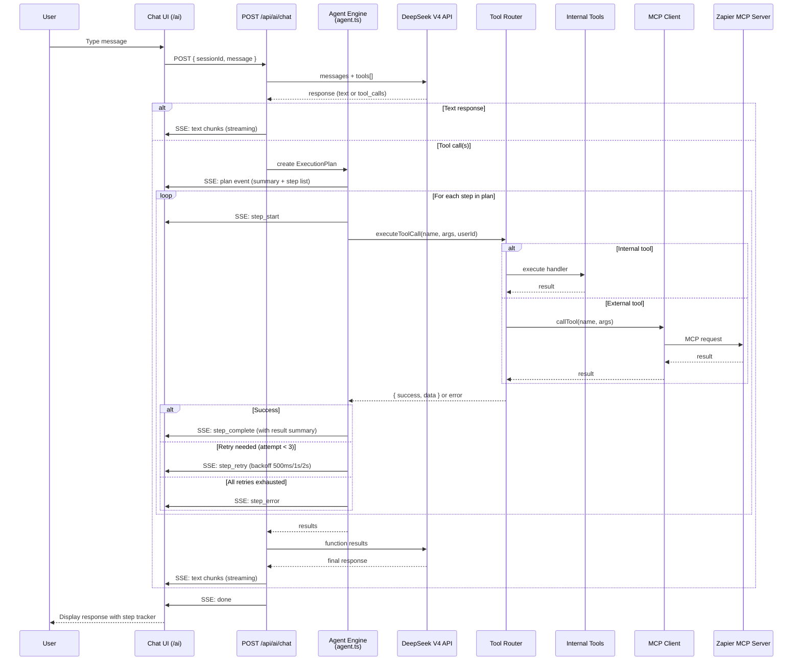
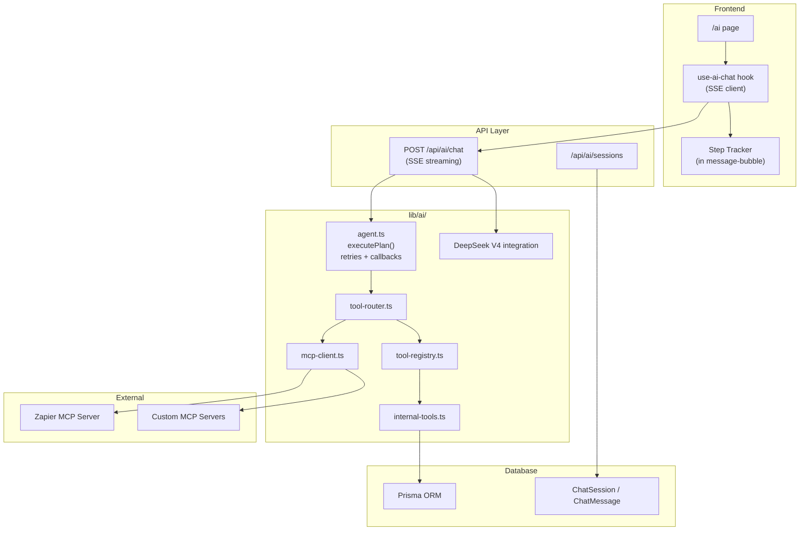

# Design Document — AI Agent & Tooling

## Overview

The AI Agent & Tooling system extends the Command Center's existing DeepSeek V4 AI integration with a tool-calling layer. The AI agent can invoke **internal tools** (CRUD on dashboard data — projects, tasks, transcriptions, ideas, etc.) and **external tools** (via MCP servers like Zapier for Google Calendar, Gmail, etc.). Users interact with the agent through a chat interface, either from a dedicated `/ai` page or a floating panel accessible from any dashboard page.

---

## Architecture

### Execution Flow

The chat API uses a **plan-based execution** model:

1. User sends a message → Chat API loads conversation history and available tools
2. Chat API calls **DeepSeek V4** with `messages + tools[]` parameters
3. DeepSeek returns either a text response or one or more `tool_calls`
4. If tool_calls are returned, the API creates an **ExecutionPlan** (list of PlanSteps) and emits a `plan` SSE event to the UI
5. `executePlan()` in the Agent Engine runs each step sequentially:
   - Each step is executed with **up to 3 retries** (500ms, 1s, 2s backoff)
   - Arguments are auto-fixed via `autoFixArgs()` (handles stringified JSON, boolean-ish strings, etc.)
   - SSE events (`step_start`, `step_complete`, `step_retry`, `step_error`) stream to the UI in real time
   - The Step Tracker component shows each step's status with visual indicators
6. Tool results are sent back to DeepSeek as function response messages
7. After all tool rounds complete (max 10 rounds × 12 calls each), DeepSeek is called in **streaming mode** to produce the final natural language text, which is streamed via SSE `text` events

### System Diagram



### Component Architecture



---

## Agent Execution Engine

The Agent Engine (`lib/ai/agent.ts`) is the core orchestration layer that manages plan-based execution of tool calls with retry logic, real-time UI callbacks, and smart result summarization.

### Types

```typescript
type StepStatus = 'pending' | 'running' | 'completed' | 'failed' | 'retrying';

interface PlanStep {
  id: string;
  description: string;          // Human-readable label (e.g. "Search Projects (query=...)")
  toolName: string;
  toolArgs: Record<string, unknown>;
  status: StepStatus;
  result?: unknown;
  error?: string;
  attempt: number;
}

interface ExecutionPlan {
  steps: PlanStep[];
  summary: string;              // e.g. "2 steps: Search Projects, Create Task"
}
```

### Callback Architecture

```typescript
interface PlanCallbacks {
  onPlan?: (plan: ExecutionPlan) => void;           // Emitted once when plan is created
  onStepStart?: (step: PlanStep) => void;           // Emitted when a step begins executing
  onStepComplete?: (step: PlanStep) => void;        // Emitted on successful execution
  onStepRetry?: (step: PlanStep, attempt: number, error: string) => void;  // Emitted before each retry
  onStepError?: (step: PlanStep, error: string) => void;  // Emitted when all retries exhausted
  onComplete?: (results: PlanStep[]) => void;       // Emitted when all steps are done
}
```

### executePlan() — Core Function

- Takes an `ExecutionPlan`, `userId`, optional `PlanCallbacks`, and optional `AbortSignal`
- Iterates through each step sequentially
- For each step, calls `executeStep()` which:
  1. Sets `status = 'running'` and emits `onStepStart`
  2. Calls `autoFixArgs()` to normalize LLM-provided arguments
  3. Calls `executeToolCall()` via the Tool Router
  4. On success: sets `status = 'completed'` and emits `onStepComplete`
  5. On failure: retries up to 3 times with exponential backoff (500ms, 1s, 2s) — emits `onStepRetry` before each retry
  6. After 3rd failure: sets `status = 'failed'` and emits `onStepError`

### Auto-Fix Parameter Normalization

The `autoFixArgs()` function handles common LLM quirks:

- **Stringified JSON:** If arguments arrive as a JSON string, they are parsed automatically
- **Boolean coercion:** String values `"true"` / `"false"` (case-insensitive) are converted to actual booleans
- **Fallback wrapping:** If parsing fails entirely, the value is wrapped in `{ value: raw }`

### Smart Result Summary Extraction

The `extractSummary()` function produces concise human-readable summaries for each tool type:

| Tool Pattern | Summary Format |
|---|---|
| `get_dashboard` | `"X projects, Y pending tasks"` |
| `search_projects` | `"Found N project(s)"` or `"No projects found"` |
| `get_project` | `"Project: name"` |
| `get_tasks` | `"X pending, Y completed"` |
| List tools (`get_*`) | `"N item(s) found"` |
| Create/Update/Delete | `"Created/Updated/Deleted successfully"` |
| `promote_idea` / `archive_idea` | `"Idea promoted"` / `"Idea archived"` |
| `generate_script` | `"Script: title"` or `"Script generated"` |

---

## Data Models

### Prisma Models

```prisma
model ChatSession {
  id        String   @id @default(cuid())
  userId    String
  title     String?  // Auto-generated from first user message
  createdAt DateTime @default(now())
  updatedAt DateTime @updatedAt

  user     User          @relation(fields: [userId], references: [id], onDelete: Cascade)
  messages ChatMessage[]

  @@index([userId])
}

model ChatMessage {
  id        String   @id @default(cuid())
  sessionId String
  role      String   // "user" | "assistant" | "tool"
  content   String   // Message text or tool result summary
  toolCalls String?  // JSON: [{ name, args, result, duration, status }]
  createdAt DateTime @default(now())

  session ChatSession @relation(fields: [sessionId], references: [id], onDelete: Cascade)

  @@index([sessionId])
}
```

### TypeScript Types

```typescript
// Tool definition registered in the registry
interface ToolDefinition {
  name: string;
  description: string;
  category: 'internal' | 'external';
  inputSchema: {
    type: 'object';
    properties: Record<string, {
      type: string;
      description?: string;
      enum?: string[];
      [key: string]: any;
    }>;
    required?: string[];
  };
  handler: (args: Record<string, any>, userId: string) => Promise<any>;
}

// Tool call audit entry stored in ChatMessage.toolCalls
interface ToolCallAuditEntry {
  name: string;
  category: 'internal' | 'external';
  args: Record<string, any>;
  result: any;
  duration: number;    // ms
  status: 'success' | 'error';
  error?: string;
}

// SSE chunk sent to client
type SSEEventType = 'text' | 'tool_call_start' | 'tool_call_end'
  | 'plan' | 'step_start' | 'step_complete' | 'step_retry' | 'step_error'
  | 'error' | 'done';

interface StepEvent {
  id: string;
  description: string;
  toolName: string;
  status: 'pending' | 'running' | 'completed' | 'failed' | 'retrying';
  result?: unknown;
  error?: string;
  attempt: number;
}

interface StreamChunk {
  type: SSEEventType;
  content?: string;
  // Legacy tool call events
  toolCall?: {
    name: string;
    status: 'pending' | 'success' | 'error';
    result?: string;
    error?: string;
  };
  // Plan-based execution events
  step?: StepEvent;
  steps?: StepEvent[];
  summary?: string;
  error?: string;
}
```

---

## API Routes

| Method | Route | Auth | Description |
|--------|-------|------|-------------|
| GET | `/api/ai/sessions` | Required | List user's chat sessions (title, message count, last updated) |
| POST | `/api/ai/sessions` | Required | Create a new chat session |
| GET | `/api/ai/sessions/[id]/messages` | Required | Get all messages for a session (paginated) |
| POST | `/api/ai/chat` | Required | Send a message and stream the response |
| DELETE | `/api/ai/sessions/[id]` | Required | Delete a session and all its messages |

### POST /api/ai/chat — Request

```json
{
  "sessionId": "abc123",
  "message": "Show me my active projects"
}
```

### POST /api/ai/chat — Response (SSE Stream)

The API sends a sequence of SSE `data:` events. Each event is a JSON object with a `type` field. The UI parses these to update the message in real time.

**Phase 1 — Plan announcement (when tool calls are needed):**

```
data: {"type": "plan", "steps": [...], "summary": "2 steps: Search Projects, Create Task"}
```

**Phase 2 — Per-step execution events:**

```
data: {"type": "step_start", "step": {"id": "call_abc", "description": "Search Projects", "toolName": "search_projects", "status": "running", "attempt": 1}}
data: {"type": "step_complete", "step": {"id": "call_abc", "description": "Search Projects", "toolName": "search_projects", "status": "completed", "result": {...}, "attempt": 1}}
data: {"type": "step_retry", "step": {"id": "call_def", "description": "Create Task", "toolName": "create_task", "status": "retrying", "error": "Timeout", "attempt": 2}}
data: {"type": "step_error", "step": {"id": "call_def", "description": "Create Task", "toolName": "create_task", "status": "failed", "error": "All retries exhausted", "attempt": 3}}
```

**Phase 3 — Final text streaming:**

```
data: {"type": "text", "content": "Here are your active projects:"}
data: {"type": "text", "content": "\n1. **Website Redesign** — 5/8 tasks completed\n2. **Content Pipeline** — 2/3 tasks completed"}
```

**Done signal:**

```
data: {"type": "done"}
```

**Error signal:**

```
data: {"type": "error", "error": "DeepSeek API error: ..."}
```

Legacy backward-compatible events (`tool_call_start`, `tool_call_end`) are also emitted alongside the new events so older clients continue to work.

### Plan-Based Tool-Calling Loop (Current)

The current implementation uses an **agent-based execution** model:

1. Build system prompt with all available tool definitions (converted to DeepSeek's function-calling format)
2. Send conversation history + new message + `tools` parameter to DeepSeek (non-streaming)
3. Parse response:
   - If `tool_calls` array present →
     a. Create an **ExecutionPlan** from the tool calls (`createPlanFromToolCalls()`)
     b. Emit `plan` SSE event with step list and summary
     c. Call `executePlan()` from the Agent Engine → runs each step sequentially with:
        - Up to 3 retries per step (500ms, 1s, 2s backoff)
        - Auto-fix parameter normalization
        - Real-time `step_start` / `step_complete` / `step_retry` / `step_error` SSE events
     d. Send tool results back to DeepSeek as function response messages
     e. Repeat from step 2 (max 10 rounds, max 12 tool calls per round)
   - If text response → fall through to streaming phase
4. After all tool rounds complete, call DeepSeek again in **streaming mode** (`stream: true`) to produce the final text response, streamed via SSE `text` events
5. Save all messages to ChatMessage table
6. Send SSE `done` event

---

## Internal Tools

Each tool has a name, description, full JSON Schema input, and a handler function.

### 1. `search_projects`
- **Description:** Search projects by name or filter by status
- **Input:**
```json
{
  "type": "object",
  "properties": {
    "query": { "type": "string", "description": "Search term to match against project name" },
    "status": { "type": "string", "enum": ["ACTIVE", "ARCHIVED", "COMPLETED"], "description": "Filter by status" }
  }
}
```
- **Handler:** `prisma.project.findMany({ where: { userId, name: { contains: query }, status } })`

### 2. `get_project_tasks`
- **Description:** Get tasks for a specific project
- **Input:**
```json
{
  "type": "object",
  "properties": {
    "projectId": { "type": "string", "description": "The project ID" },
    "status": { "type": "string", "enum": ["pending", "completed"], "description": "Filter by completion status" }
  },
  "required": ["projectId"]
}
```
- **Handler:** Fetch project (verify ownership), then return tasks

### 3. `create_task`
- **Description:** Create a new task in a project
- **Input:**
```json
{
  "type": "object",
  "properties": {
    "projectId": { "type": "string", "description": "The project to add the task to" },
    "title": { "type": "string", "description": "Task title" },
    "priority": { "type": "string", "enum": ["LOW", "MEDIUM", "HIGH"] },
    "dueDate": { "type": "string", "description": "Due date (ISO 8601)" }
  },
  "required": ["projectId", "title"]
}
```
- **Handler:** `prisma.task.create({ data: { projectId, title, priority, dueDate } })`

### 4. `update_task`
- **Description:** Mark a task as complete or incomplete
- **Input:**
```json
{
  "type": "object",
  "properties": {
    "taskId": { "type": "string", "description": "The task ID" },
    "completed": { "type": "boolean", "description": "true = done, false = not done" }
  },
  "required": ["taskId", "completed"]
}
```
- **Handler:** Verify task ownership via project chain, then update

### 5. `delete_task`
- **Description:** Delete a task permanently
- **Input:**
```json
{
  "type": "object",
  "properties": {
    "taskId": { "type": "string", "description": "The task ID" }
  },
  "required": ["taskId"]
}
```
- **Handler:** Verify ownership, then delete (cascades to subtasks)

### 6. `get_transcriptions`
- **Description:** List saved transcriptions
- **Input:**
```json
{
  "type": "object",
  "properties": {
    "limit": { "type": "number", "description": "Max results (default 10)" }
  }
}
```

### 7. `search_transcriptions`
- **Description:** Search transcriptions by text content or title
- **Input:**
```json
{
  "type": "object",
  "properties": {
    "query": { "type": "string", "description": "Search term" }
  },
  "required": ["query"]
}
```

### 8. `create_idea`
- **Description:** Add a new idea to Idea Hub
- **Input:**
```json
{
  "type": "object",
  "properties": {
    "title": { "type": "string", "description": "Idea title" },
    "rawNotes": { "type": "string", "description": "Optional notes" },
    "tags": { "type": "array", "items": { "type": "string" }, "description": "Tags for categorization" }
  },
  "required": ["title"]
}
```

### 9. `get_ideas`
- **Description:** List ideas, optionally filtered
- **Input:**
```json
{
  "type": "object",
  "properties": {
    "status": { "type": "string", "enum": ["raw", "promoted", "archived"] },
    "tag": { "type": "string", "description": "Filter by tag" }
  }
}
```

### 10. `generate_script`
- **Description:** Generate a script draft using AI
- **Input:**
```json
{
  "type": "object",
  "properties": {
    "topic": { "type": "string", "description": "The topic/subject for the script" },
    "personaId": { "type": "string", "description": "Optional persona ID for voice style" },
    "styleId": { "type": "string", "description": "Optional script style ID" }
  },
  "required": ["topic"]
}
```
- **Handler:** Reuses existing `lib/ai.ts` — loads persona lessons/examples, calls DeepSeek, returns draft

### 11. `send_email`
- **Description:** Send an email via the configured Brevo integration
- **Input:**
```json
{
  "type": "object",
  "properties": {
    "to": { "type": "string", "description": "Recipient email address" },
    "subject": { "type": "string", "description": "Email subject" },
    "body": { "type": "string", "description": "Email body text" }
  },
  "required": ["to", "subject", "body"]
}
```
- **Handler:** Reuses existing `lib/email.ts`

---

## External Tools (via MCP)

These tools are discovered dynamically at runtime from connected MCP servers. The expected schemas for Zapier MCP:

| Tool | Service | Description |
|------|---------|-------------|
| `add_calendar_event` | Google Calendar | Create event: `{ summary, startTime, endTime, description? }` |
| `get_calendar_events` | Google Calendar | List events: `{ maxResults?, timeMin?, timeMax? }` |
| `send_gmail` | Gmail | Send email: `{ to, subject, body }` |
| `create_google_doc` | Google Docs | Create doc: `{ title, content? }` |

### MCP Client Architecture

The MCP client (`lib/ai/mcp-client.ts`) manages connections to external MCP servers:

```typescript
class MCPServerManager {
  private connections: Map<string, MCPConnection> = new Map();

  // Called when an MCP service is configured in Integrations
  async connect(serviceId: string, endpoint: string, credentials: any): Promise<void>;

  // Called on startup — reconnect to all configured MCP services
  async reconnectAll(): Promise<void>;

  // Discovers available tools from the MCP server
  async discoverTools(serviceId: string): Promise<ToolDefinition[]>;

  // Routes a tool call to the appropriate MCP server
  async callTool(serviceId: string, toolName: string, args: any): Promise<any>;

  // Called when an MCP service is disabled/deleted
  async disconnect(serviceId: string): Promise<void>;
}
```

### Dynamic Tool Registration Flow

1. User configures Zapier MCP in Integrations (`/integrations/zapier`)
2. System connects to Zapier's MCP endpoint with stored API key
3. System discovers available tools (e.g., `add_calendar_event`, `send_gmail`)
4. Each discovered tool is wrapped in a `ToolDefinition` with `category: 'external'`
5. Tools are registered in the Tool Registry
6. When the AI needs to call an external tool, the Tool Router routes through the MCP Client
7. On disconnect, tools are removed from the registry

---

## Chat UI Components

### Component Tree

```
app/(dashboard)/ai/page.tsx          — Full chat page layout
├── components/ai/chat-sidebar.tsx   — Session list sidebar
│   ├── Session list items
│   ├── New session button
│   └── Search/filter sessions
├── components/ai/chat-messages.tsx  — Message list area
│   ├── components/ai/message-bubble.tsx   — User/assistant message
│   └── components/ai/tool-card.tsx        — Tool call indicator card
└── components/ai/chat-input.tsx     — Input area with send button

components/ai/chat-fab.tsx           — Floating action button
components/ai/chat-slideover.tsx     — Slide-over chat panel (for dashboard pages)
```

### Step Tracker (within Message Bubbles)

When the AI needs to call tools, the assistant message renders a **Step Tracker** — a list of steps with real-time status indicators updated via SSE events:

| Event | Visual State |
|---|---|
| `plan` | Show step count summary at top of message |
| `step_start` | Step shows spinner + tool name + description |
| `step_complete` | Shows ✅ checkmark + result summary (via `extractSummary()`) |
| `step_retry` | Shows ⏳ retry badge with attempt number (e.g. "Retry 2/3") |
| `step_error` | Shows ❌ error icon + error message |

Each step is rendered inline as a compact row:

```
┌─ ✅ Search Projects ───────────────────────
│  Found 3 project(s)
└─────────────────────────────────────────────
┌─ ⏳ Create Task (Retry 2/3) ───────────────
│  Timeout error, retrying...
└─────────────────────────────────────────────
┌─ ❌ Generate Script ───────────────────────
│  All retries exhausted: API timeout
└─────────────────────────────────────────────
```

### Message Bubble Layout
- **User messages:** Right-aligned, accent-colored background
- **Assistant messages:** Left-aligned, panel background
- **Tool call cards / Step Tracker:** Inline between messages, styled as info cards
- **Streaming indicator:** Cursor animation while text is being received via SSE `text` events

### Floating Chat Trigger
- FAB visible on all dashboard pages (bottom-right corner)
- Click opens a slide-over panel (400px wide on desktop, full-width on mobile)
- Panel includes the same chat interface as `/ai`
- Context injection: the current page URL and module are included in the system prompt so the AI knows where the user is

---

## Error Handling

| Scenario | Handling |
|----------|----------|
| Tool call timeout (internal) | Return error after 10s, log audit entry |
| Tool call timeout (external/MCP) | Return error after 30s, log audit entry |
| MCP server unreachable | Return descriptive error, log connection failure |
| Invalid tool parameters | Return schema validation error with details |
| DeepSeek API error | Return error message, log status code |
| Rate limit hit | Return "too many tool calls" error |
| Unauthorized tool call | Return auth error (should not happen — scoped by userId) |

---

## Security

1. **Authentication scoping:** All tool handlers receive `userId` and scope queries to that user only
2. **Write confirmation:** Before destructive operations (create/update/delete), the AI asks the user to confirm. The chat UI shows a confirmation prompt.
3. **External service disclosure:** Tool call cards for external tools display an "External Service" badge
4. **Credential storage:** MCP server API keys are stored encrypted in the API Key Store (reusing existing `api-key-crypto.ts`)
5. **Audit trail:** Every tool call is logged in `ChatMessage.toolCalls` as JSON with name, args, result, duration, and status

---

## File Structure

```
src/
├── lib/ai/
│   ├── db.ts                    — Chat session/message DB queries
│   ├── tool-registry.ts         — Central tool registry
│   ├── internal-tools.ts        — Internal tool definitions and handlers (22+ tools)
│   ├── agent.ts                 — Agent execution engine (executePlan, retries, callbacks)
│   ├── mcp-client.ts            — MCP client for external services
│   └── tool-router.ts           — Routes tool calls to handlers
├── app/api/ai/
│   ├── sessions/
│   │   ├── route.ts             — GET list, POST create
│   │   └── [id]/
│   │       ├── route.ts         — DELETE session
│   │       └── messages/route.ts — GET messages
│   └── chat/route.ts            — POST chat (SSE streaming)
├── hooks/use-ai-chat.ts         — SSE streaming chat hook
├── app/(dashboard)/ai/page.tsx  — Full chat page
└── components/ai/
    ├── chat-sidebar.tsx         — Session list sidebar
    ├── chat-messages.tsx        — Message list
    ├── chat-input.tsx           — Text input
    ├── message-bubble.tsx       — Message bubble
    ├── tool-card.tsx            — Tool call indicator
    ├── chat-fab.tsx             — Floating action button
    └── chat-slideover.tsx       — Slide-over panel
```

---

## Future Considerations

- **Multi-turn tool sequences:** The AI could call multiple tools in sequence based on intermediate results
- **Streaming tool results:** Large results (e.g., transcription text) streamed to the client progressively
- **Custom MCP servers:** Admins can add any MCP-compatible server endpoint via integrations
- **Tool usage analytics:** Track which tools are used most frequently to prioritize improvements
- **Voice input:** Integrate browser speech recognition for voice-to-chat
