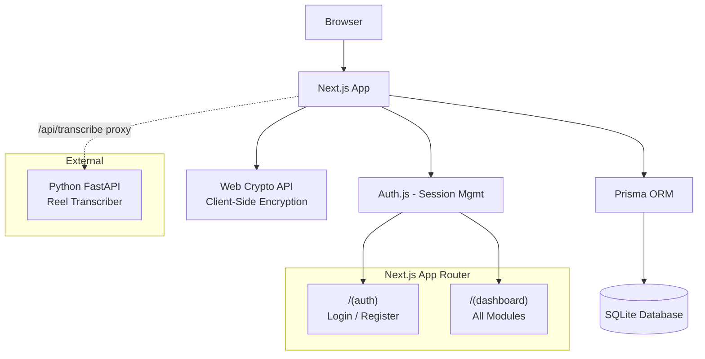
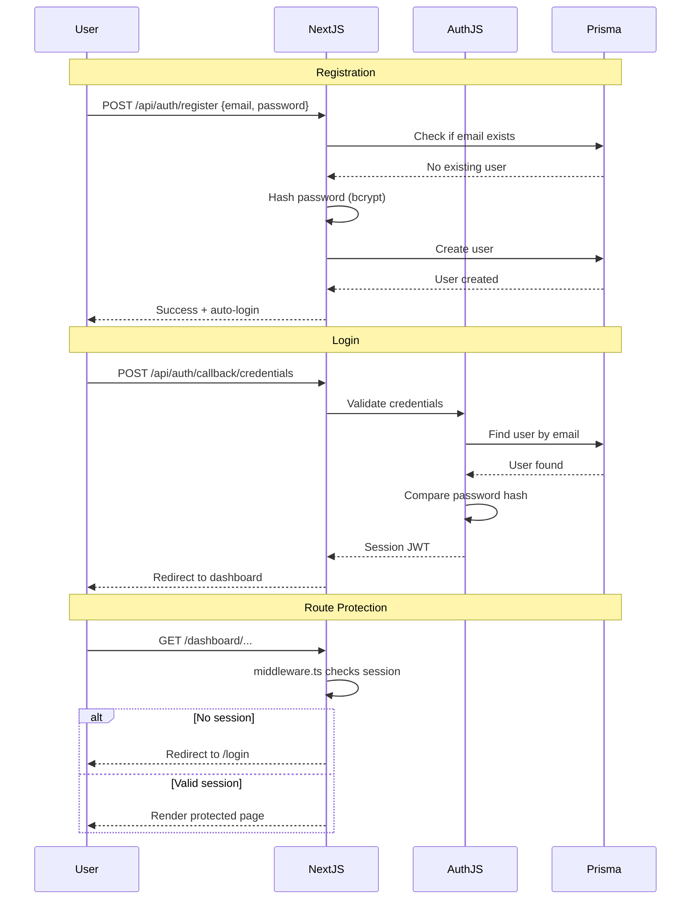
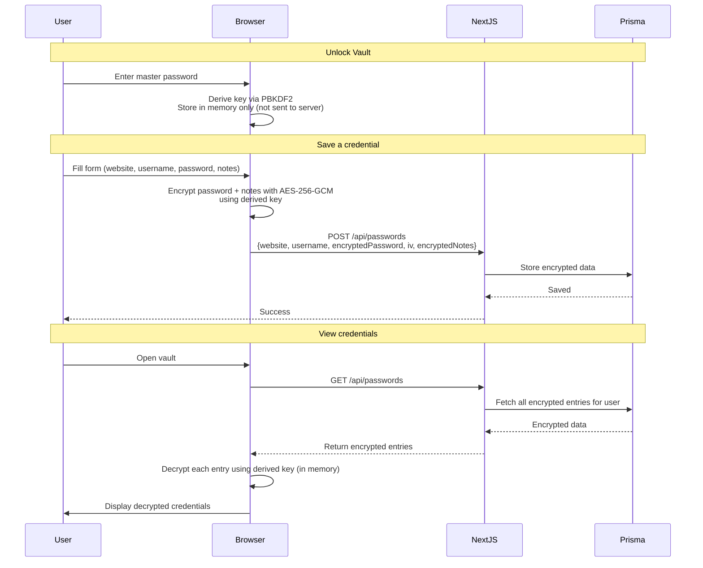
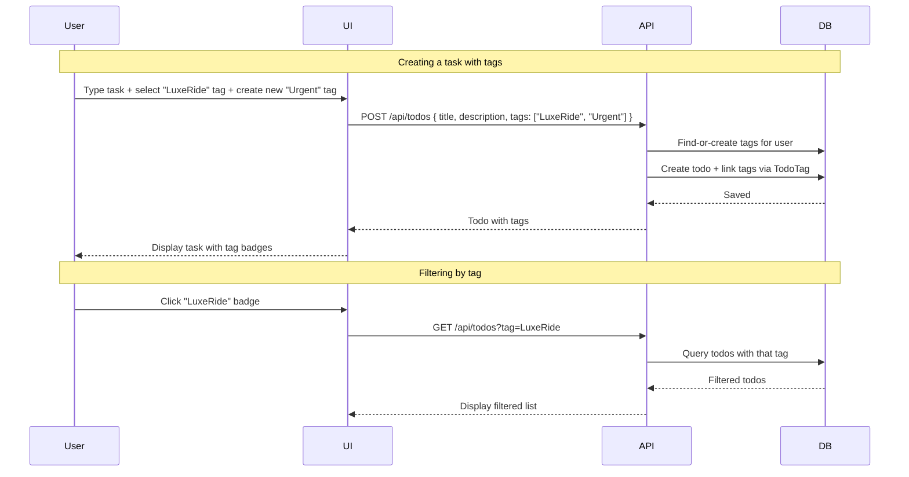

# Design Document — Command Center

## Overview

The Command Center is a Next.js 14+ dashboard that centralizes the user's business operations, content creation tools, personal productivity, and secure credential management. It uses a modular architecture where each feature is a self-contained route within the authenticated dashboard shell.

The design follows a **data-first approach**: all modules share the same database (SQLite via Prisma), the same authentication layer (Auth.js), and the same UI component system (shadcn/ui + Tailwind). The Python-based Reel Transcriber runs as a sidecar microservice, proxied through a Next.js API route.

---

## Architecture



## Directory Structure

```
command-center/
├── prisma/
│   └── schema.prisma              # Database schema
├── src/
│   ├── app/
│   │   ├── (auth)/
│   │   │   ├── login/
│   │   │   │   └── page.tsx
│   │   │   ├── register/
│   │   │   │   └── page.tsx
│   │   │   └── layout.tsx         # Centered layout for auth pages
│   │   ├── (dashboard)/
│   │   │   ├── layout.tsx         # Sidebar + header layout
│   │   │   ├── page.tsx           # Dashboard overview / home
│   │   │   ├── passwords/
│   │   │   │   └── page.tsx
│   │   │   ├── transcriber/
│   │   │   │   └── page.tsx
│   │   │   ├── invoices/
│   │   │   │   ├── page.tsx       # Invoice list
│   │   │   │   └── [id]/
│   │   │   │       └── page.tsx   # Invoice detail
│   │   │   └── todos/
│   │   │       └── page.tsx
│   │   ├── api/
│   │   │   ├── auth/
│   │   │   │   └── [...nextauth]/
│   │   │   │       └── route.ts
│   │   │   ├── passwords/
│   │   │   │   └── route.ts       # CRUD for password entries
│   │   │   ├── invoices/
│   │   │   │   └── route.ts       # CRUD for invoices
│   │   │   ├── todos/
│   │   │   │   └── route.ts       # CRUD for todos
│   │   │   └── transcribe/
│   │   │       └── route.ts       # Proxies to Python microservice
│   │   └── globals.css
│   ├── components/
│   │   ├── ui/                    # shadcn/ui primitives
│   │   ├── dashboard/
│   │   │   ├── sidebar.tsx
│   │   │   ├── header.tsx
│   │   │   └── overview-cards.tsx
│   │   ├── passwords/
│   │   │   ├── vault-list.tsx
│   │   │   ├── add-credential-dialog.tsx
│   │   │   └── master-password-prompt.tsx
│   │   ├── transcriber/
│   │   │   ├── url-input.tsx
│   │   │   └── transcript-result.tsx
│   │   ├── invoices/
│   │   │   ├── invoice-list.tsx
│   │   │   ├── invoice-form.tsx
│   │   │   └── invoice-card.tsx
│   │   └── todos/
│   │       ├── todo-list.tsx
│   │       ├── todo-item.tsx
│   │       ├── add-todo-form.tsx
│   │       ├── tag-selector.tsx
│   │       └── tag-manager.tsx
│   ├── lib/
│   │   ├── auth.ts                # Auth.js configuration
│   │   ├── db.ts                  # Prisma client singleton
│   │   ├── crypto.ts              # Web Crypto API helpers
│   │   └── utils.ts               # Shared utilities
│   └── middleware.ts              # Route protection
├── instagram-transcriber/         # Python microservice (unchanged)
│   ├── app.py
│   ├── downloader.py
│   ├── transcriber.py
│   └── requirements.txt
├── .env
├── package.json
├── tailwind.config.ts
├── postcss.config.js
├── tsconfig.json
└── next.config.ts
```

## Data Models (Prisma Schema)

```prisma
enum InvoiceStatus {
  DRAFT
  SENT
  PAID
  OVERDUE
}

model User {
  id        String   @id @default(cuid())
  email     String   @unique
  password  String   // bcrypt hashed
  name      String?
  createdAt DateTime @default(now())
  updatedAt DateTime @updatedAt

  passwords PasswordEntry[]
  invoices  Invoice[]
  todos     Todo[]
  tags      Tag[]
}

model PasswordEntry {
  id                String   @id @default(cuid())
  userId            String
  website           String
  username          String
  encryptedPassword String   // AES-256-GCM ciphertext (base64)
  iv                String   // Initialization vector (base64)
  notes             String?  // Also encrypted (base64)
  createdAt         DateTime @default(now())
  updatedAt         DateTime @updatedAt

  user User @relation(fields: [userId], references: [id], onDelete: Cascade)
}

model Invoice {
  id            String        @id @default(cuid())
  userId        String
  clientName    String
  clientEmail   String?
  amount        Float
  dueDate       DateTime?
  description   String?
  status        InvoiceStatus @default(DRAFT)
  invoiceNumber String
  createdAt     DateTime      @default(now())
  updatedAt     DateTime      @updatedAt

  user User @relation(fields: [userId], references: [id], onDelete: Cascade)
}

model Todo {
  id          String   @id @default(cuid())
  userId      String
  title       String
  description String?
  dueDate     DateTime?
  completed   Boolean  @default(false)
  createdAt   DateTime @default(now())
  updatedAt   DateTime @updatedAt

  user User   @relation(fields: [userId], references: [id], onDelete: Cascade)
  tags TodoTag[]
}

model Tag {
  id     String   @id @default(cuid())
  userId String
  name   String   // e.g. "LuxeRide", "Content", "Personal", "Health", etc.

  user User    @relation(fields: [userId], references: [id], onDelete: Cascade)
  todos TodoTag[]

  @@unique([userId, name]) // no duplicate tags per user
}

model TodoTag {
  todoId String
  tagId  String

  todo Todo @relation(fields: [todoId], references: [id], onDelete: Cascade)
  tag  Tag  @relation(fields: [tagId], references: [id], onDelete: Cascade)

  @@id([todoId, tagId])
}
```

## Component Tree

```mermaid
graph TD
    RootLayout --> AuthLayout["(auth)/layout.tsx"]
    RootLayout --> DashLayout["(dashboard)/layout.tsx"]
    
    AuthLayout --> LoginPage
    AuthLayout --> RegisterPage
    
    DashLayout --> Sidebar
    DashLayout --> Header
    DashLayout --> {Content}
    
    Sidebar --> NavItems["Home, Passwords,<br/>Transcriber, Invoices,<br/>Todos"]
    
    Content --> DashboardHome["Dashboard Home<br/>Overview Cards"]
    Content --> PasswordsPage
    Content --> TranscriberPage
    Content --> InvoicesPage
    Content --> TodosPage
    
    DashboardHome --> StatCards["Total Invoices<br/>Pending Tasks<br/>Recent Activity"]
    
    PasswordsPage --> MasterPasswordPrompt
    PasswordsPage --> VaultList
    PasswordsPage --> AddCredentialDialog
    
    TranscriberPage --> URLInput
    TranscriberPage --> TranscriptResult
    
    InvoicesPage --> InvoiceList
    InvoicesPage --> InvoiceForm
    InvoicesPage --> InvoiceDetail
    
    TodosPage --> AddTodoForm
    TodosPage --> TodoList
    TodosPage --> TagManager
    TodoList --> TodoItem
    AddTodoForm --> TagSelector["TagSelector
Create or pick existing tags"]
```

## Authentication Flow



## Password Manager Encryption Flow



## Transcriber Integration

Two options exist:

**Option A — Microservice (Recommended for Phase 1)**
- Keep the Python FastAPI server running on a local port (e.g., 8001)
- Next.js API route `/api/transcribe` proxies the request to `http://localhost:8001/api/transcribe`
- Pros: Zero changes to the working Python code, separation of concerns
- Cons: Requires Python server to be running

**Option B — Port to TypeScript**
- Rewrite download + transcribe logic in TypeScript using `yt-dlp-exec` and `whisper.cpp` bindings
- Pros: Fully self-contained in Next.js
- Cons: Rewriting working code, whisper.cpp bindings are less mature

**Recommendation:** Start with Option A (microservice). Later, if needed, we can containerize with Docker Compose so both servers start together.

## Error Handling Strategy

| Layer | Approach |
|-------|----------|
| **API Routes** | Try/catch with structured error responses `{ error: string, code: string }` |
| **Server Actions** | Return `{ success: boolean, error?: string }` objects |
| **Client Components** | Toast notifications for success/error feedback (sonner) |
| **Auth** | Auth.js handles errors; custom error pages for 401/403 |
| **Transcriber** | Network error → "Transcriber service unavailable" message; Validation → "Invalid URL" |

## Dynamic Tags (Todo System)

Tags are many-to-many with todos, meaning one task can have multiple tags (e.g. "LuxeRide" + "Urgent").

**Tag workflow:**
1. When adding/editing a todo, a tag input shows existing tags with autocomplete
2. User can type a new tag name → it gets created on save
3. Clicking a tag badge filters the todo list to that tag
4. A small "Manage Tags" section lets users rename or delete tags they've created



## Page Layouts

### Auth Pages (Login / Register)
- Centered card layout
- Minimal — just the form + branding
- Links to toggle between login/register

### Dashboard Layout
```
┌─────────────────────────────────────┐
│  Header: Logo | Search | User Menu   │
├──────────┬──────────────────────────┤
│          │                          │
│ Sidebar  │   Page Content           │
│          │                          │
│ 🏠 Home  │                          │
│ 🔐 Vault │                          │
│ 🎬 Reels │                          │
│ 📄 Invs  │                          │
│ ✅ Todos │                          │
│          │                          │
└──────────┴──────────────────────────┘
```

### Dashboard Home
- Welcome message with user's name
- Summary cards: Total Invoices, Pending Todos, Recent Activity
- Quick-action buttons: "New Invoice", "Add Task", "Transcribe Reel"

### Responsive Behavior
- **Desktop (>768px)**: Sidebar always visible on the left
- **Mobile (<768px)**: Sidebar hidden behind hamburger toggle; content takes full width
- Layout uses Tailwind's `md:` breakpoint

## UI Design System

- **Theme**: Dark mode by default (matching the reeltext receipt-style aesthetic)
- **Colors**: Dark backgrounds, green accents (from the reeltext template), amber for warnings
- **Components**: shadcn/ui with custom Command Center theme
- **Font**: Inter (UI) with JetBrains Mono for code/transcript display

```css
:root {
  --background: #0b0e0c;
  --panel: #10140f;
  --border: #1e2a1c;
  --foreground: #d8e4d0;
  --muted: #6b7a63;
  --accent: #7fd858;
  --warning: #ffb347;
  --danger: #ff6b5e;
}
```

## Testing Strategy

- **Unit tests**: Utility functions (crypto, formatting, validation)
- **Component tests**: Critical UI components (sidebar, todo list, invoice form)
- **API tests**: CRUD endpoints for each module
- **E2E**: Auth flow (register → login → protected route access)

Phase 1 focuses on **manual testing** during development, with unit tests for the crypto module (critical for security).

## Dependencies (Key Packages)

```json
{
  "next": "^14.2",
  "react": "^18.3",
  "next-auth": "^5.0",
  "@prisma/client": "^5.x",
  "prisma": "^5.x",
  "bcryptjs": "^2.4",
  "tailwindcss": "^3.4",
  "@radix-ui/react-dialog": "^1.x",
  "@radix-ui/react-dropdown-menu": "^2.x",
  "@radix-ui/react-select": "^2.x",
  "lucide-react": "^0.x",
  "class-variance-authority": "^0.7",
  "clsx": "^2.x",
  "tailwind-merge": "^2.x",
  "sonner": "^1.x",
  "zod": "^3.x"
}
```
